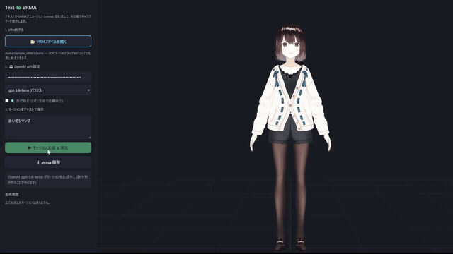

# Text-To-VRMA — VRM特化型Text-To-Motionツール

[](https://github.com/sponsors/Kirakun0328)



テキストを入力すると AI がモーションを生成し、
**VRMA (VRM Animation / `.vrma`)** ファイルをブラウザ内で生成して、
その場で VRM キャラクターを動かす Web アプリです。
生成した `.vrma` はファイルとして保存でき、VRMA 対応アプリでそのまま利用できます。

例:「その場で歩く」「喜んでジャンプする」「手を振る」「悲しそうにうつむく」

生成エンジンは2種類から選べます:

| エンジン | 特徴 | 必要なもの |
| --- | --- | --- |
| **LLMキーフレーム** (OpenAI API / Codex) | 正確なポーズ・手指・表情の指定が得意。セットアップ不要でどのPCでも動く | APIキー または Codexプラン |
| **ARDYローカルエンジン** (v1.1〜) | NVIDIAのモーション生成AI [ARDY](https://github.com/nv-tlabs/ardy) をローカル実行。歩行・ダンス・ジャンプ等の全身運動が**モーションキャプチャ品質**。生成無制限・オフライン動作 | 追加セットアップ (下記) |

ARDYモードは **GPT (頭) × ARDY (体) のハイブリッド**として動作し、APIキーがあれば
依頼内容に応じて2つのエンジンを自動で使い分けます。

モーションと同時に**表情** (笑顔・悲しみ・驚き・まばたき等) も生成されます。
`.vrma` 保存時に「表情を含める / 含めない (ボーンモーションのみ)」を選択できます。

## 必要なもの

- Node.js 20+
- 次のいずれか
  - OpenAI API キー ([platform.openai.com](https://platform.openai.com/) で取得)
  - デスクトップ版では、PATH 上の Codex CLI 0.144.1 以上と利用可能なChatGPT/Codexプラン

Codexサブスクリプション認証はElectronデスクトップ版専用です。ブラウザ版ではAPIキーを使用してください。
Codex CLIはアプリに同梱されないため、別途インストールが必要です。

VRM モデルは [VRoid 公式サンプルモデル (AvatarSample)](https://hub.vroid.com/characters/2843975675147313744/models/5644550979324015604)
の VRM1.0 版・VRM0.0 版を同梱しており、起動時に VRM1.0 版が読み込まれます。
手持ちの `.vrm` への差し替えも可能です。

VRM **0.x / 1.0 の両形式に対応**しています (three-vrm が自動判別し、向きも正規化)。

## セットアップ & 起動

```sh
git clone https://github.com/Kirakun0328/text-to-vrma.git
cd text-to-vrma
npm install
npm run dev
# → http://localhost:5173 をブラウザで開く
```

## 使い方

1. 起動するとサンプルモデル (AvatarSample VRM1.0版) が読み込まれます。
   「VRMファイルを開く」または 3D ビューへのドラッグ&ドロップで手持ちの VRM に差し替え可能
2. 認証方式とモデルを選択
   - **OpenAI APIキー**: キーを入力し、API用モデルを選択します。キーはブラウザの
     localStorage にのみ保存され、OpenAI 以外には送信されません
   - **Codexサブスクリプション（デスクトップ版）**: 「ChatGPTでログイン」を押して
     既定ブラウザで認証します。既にCodex CLIでログイン済みなら、その認証を再利用します
   - CodexのトークンはCodex CLIが管理し、アプリのレンダラーやlocalStorageには保存されません
3. テキストを入力して「▶ モーション生成 & 再生」 (Ctrl+Enter でも可)
   - 「🔍 自己修正」ON (デフォルト) では生成後にもう1パス、可動域・軌道・緩急の
     セルフレビューを行い品質を上げます (API呼び出しが2回になります)
   - 「ループ再生」で 自動 / 常にループ / 1回だけ を選択できます
4. 「⬇ .vrma 保存」で生成アニメーションをファイルに書き出し

## ARDYローカルエンジン (オプション)

NVIDIA Research の text-to-motion モデル
[ARDY](https://research.nvidia.com/labs/sil/projects/ardy/) (SIGGRAPH 2026) を
ローカルで動かし、モーションキャプチャ品質の全身モーションを生成するモードです。

**できること:**

- 歩く・走る・踊る・ジャンプ・格闘などの全身運動を、実際の人間のモーション
  キャプチャデータで学習したAIが生成 (重心移動・勢い・足の接地が本物らしい)
- **日本語プロンプトOK** — ローカル翻訳 (FuguMT) で自動英訳。
  OpenAI APIキーが保存済みなら GPT が英訳+連続動作の分割まで行い、精度が上がります
- **📍 経由地モード** — 3Dビューの床をクリックして経由地を置くと、
  キャラクターがその順番に通るモーションを生成 (右クリックで1つ取り消し)
- モーションの長さ・表情・ループ可否は内容から自動判断 (長さは最長60秒)
- 生成回数無制限・完全ローカル (セットアップ後はオフラインで動作)

**動作要件と速度:**

| | 最低 | 推奨 |
| --- | --- | --- |
| OS | Windows 10/11 64bit | 同左 |
| RAM | 16GB | 32GB+ |
| ディスク | 35GB | 同左 |
| GPU | 不要 (CPUで1回数十秒) | NVIDIA GPU 6GB+ (1回数秒) |

**セットアップ** (Python 3.10+ と git が必要。約20GBダウンロードします):

```powershell
powershell -ExecutionPolicy Bypass -File tools\ardy-engine\install.ps1
```

完了後、エンジンを起動してからアプリの「ARDYローカルエンジン」モードを選択します。
詳細・手動起動・APIは [tools/ardy-engine/README.md](tools/ardy-engine/README.md) を参照してください。

本機能は Meta Llama 3 をテキストエンコーダとして利用しています。**Built with Meta Llama 3**

## アーキテクチャ

```text
[LLMキーフレームモード]
テキスト ── OpenAI API / Codex CLI ──▶ モーション spec (ボーン別オイラー角キーフレーム JSON)

[ARDYモード]
テキスト ── GPT (英訳・動作分割・エンジン振り分け) ──▶ ARDYエンジンサーバー (localhost:2337)
              │                                        │ 拡散モデルで20fpsモーション生成
              └ APIキーなしならローカル翻訳            │ → 足滑り補正 → VRMリターゲット
                                                       ▼
                                          モーション spec (共通フォーマット)
```

spec 以降は両モード共通:

```text
                          モーション spec
                                   │
                                   ▼
              vrmaBuilder.js ── glTF + VRMC_vrm_animation 拡張 → GLB (.vrma)
                                   │
                                   ▼
              viewer.js ── three.js + @pixiv/three-vrm-animation で VRM に再生
```

| ファイル | 役割 |
| --- | --- |
| `src/llm.js` | OpenAI API へのプロンプト (ボーン規約・お手本モーション5種) / 2パス自己修正 / spec 検証・角度クランプ |
| `src/vrmaBuilder.js` | モーション spec から VRMA (GLB) をバイナリ生成。VRM1 規約の T ポーズ骨格を埋め込み、`VRMC_vrm_animation` 拡張でヒューマノイドボーンをマッピング |
| `src/viewer.js` | three.js シーン / VRM ロード / VRMA 再生 |
| `src/idleMotion.js` | 待機モーション (呼吸) |
| `src/main.js` | UI 結線 |
| `src/autoExpressions.js` | ARDYモード用: 感情語からの表情自動付与 + まばたき |
| `electron/codex-client.cjs` | Codex app-server接続 / ChatGPT認証 / モデル取得 / 一時スレッドでの生成 |
| `electron/ardy-client.cjs` | ARDYエンジンサーバーの起動・監視 (デスクトップ版) |
| `electron/preload.cjs` | 認証情報を公開しない限定IPCブリッジ |
| `tools/ardy-engine/server.py` | ARDY常駐サーバー: 生成・日本語翻訳・経由地制約・進捗API |
| `tools/ardy-engine/retarget.py` | ARDY Coreスケルトン → VRM Humanoid リターゲット |
| `tools/ardy-engine/install.ps1` | エンジンのワンコマンドセットアップ |

## モーション spec フォーマット

LLM が生成する中間表現です:

```json
{
  "name": "wave",
  "duration": 2.6,
  "loop": true,
  "tracks": {
    "rightUpperArm": [
      { "t": 0, "r": [0, 0, 70] },
      { "t": 0.4, "r": [0, 0, -45] }
    ]
  },
  "hips": [ { "t": 0, "p": [0, 0, 0] } ]
}
```

- `r` = T ポーズからのオイラー角 [X, Y, Z] (度) / `p` = 腰位置オフセット (m)
- `expressions` は VRM プリセット表情 (happy / blink 等) のウェイト (0〜1)。
  プレビューでは常に再生され、`.vrma` 保存時は含めるかどうかを選択できます
  (再生側アプリが VRMA の表情トラックに対応している必要があります)
- 座標規約: モデルは +Z 正面 / +X が左手側 (VRM 1.0 準拠)

## 注意事項

- **動作確認環境: Windows 11** (macOS / Linux では動作未確認です。
  ブラウザで動く Web アプリのため動作する見込みはありますが、保証はありません)
- APIキーモードのモーション生成には OpenAI API の利用料が発生します (1回あたり数円〜十数円程度。
  使用モデルとモーションの長さによって変動)
- OpenAI の [データ共有プログラム (Complimentary daily tokens)](https://help.openai.com/en/articles/10306912-sharing-feedback-evaluation-and-fine-tuning-data-and-api-inputs-and-outputs-with-openai)
  を有効にすると、1日あたりの無料トークン枠内で**無料で試せます**
  (API の入出力が OpenAI のモデル学習に共有される点に注意。対象アカウント・地域の条件あり。
  本プログラムは OpenAI 側の都合で変更・終了される可能性があります)
- Codexモードはログイン中のChatGPT/Codexプランの利用上限と組織ポリシーに従います。
  Codexサブスクリプションの本ツールでの利用が OpenAI の利用規約・ポリシー上
  許容されるかは利用者自身でご確認ください (利用は自己責任です)
- アプリ内のCodexログアウトは、このPC上のCodex CLI全体のログイン状態へ影響します
- ARDYローカルエンジンは実験的機能です。モデルの性質上、同じテキストでも生成のたびに
  違うモーションになります (気に入らなければ再生成してください)。
  モデル重み (NVIDIA ARDY / Meta Llama 3 / FuguMT) は本リポジトリに含まれず、
  セットアップ時に各配布元 (Hugging Face) から利用者自身がダウンロードします。
  各モデルのライセンスは [THIRD_PARTY_NOTICES.md](THIRD_PARTY_NOTICES.md) を参照してください
- 生成される `.vrma` の利用は各自の責任で行ってください
- **免責事項**: 本ツールは現状のまま・無保証で提供されます。本ツールの利用
  または利用不能により生じたいかなる損害 (API 利用料、データの損失、
  生成物に起因するトラブル等を含む) についても、開発者は一切の責任を負いません

## 💖 支援のお願い / Support This Project

**Text-To-VRMA は、個人開発の無料オープンソースです。**

「テキストを打つだけで、誰でも自分のキャラクターを動かせる」——
その世界を目指して、NVIDIAの最新モーションAI (ARDY) の統合のような挑戦も含め、
これからも便利で使いやすいオープンソースを公開していく予定です。

正直に書くと、いまは職を離れ、生活的に厳しい状況の中で開発を続けています。
それでも作りたいものがたくさんあります。もし本ツールが役に立ったなら、
応援・ご支援をいただけるととても励みになります 🙇

---

**Text-To-VRMA is free & open-source, built by an independent developer in Japan.**

The goal: anyone can bring their VRM character to life just by typing —
powered by state-of-the-art motion AI, running on your own PC, free forever.

I'll be honest: I'm currently between jobs and building this through financially
difficult times. But there is so much more I want to create — more open-source
tools for the VRM / VTuber / creative community.

If this tool helps you, or you simply want to see more projects like it,
your support genuinely keeps this work (and its developer) going 💚

### **[❤️ GitHub Sponsors — github.com/sponsors/Kirakun0328](https://github.com/sponsors/Kirakun0328)**

スターを付けてもらえるだけでも大きな励みになります! / Even a ⭐ on this repo means a lot!

## 開発者

- X (Twitter): [@Kiratchi0328](https://x.com/Kiratchi0328)

## ライセンス

- ソースコード: MIT License (Copyright (c) 2026 Kiratchi)。
  **MIT License はソースコードにのみ適用され、サードパーティ素材 (同梱 VRM モデル等) は対象外です**
  (詳細は [THIRD_PARTY_NOTICES.md](THIRD_PARTY_NOTICES.md))
- **クレジット表記のお願い**: 本ツールをアプリやサービスに組み込む場合、
  義務ではありませんが、画面やクレジット欄に以下のような表記をしていただけると嬉しいです。

  ```text
  Motion generation powered by Text-To-VRMA (© Kiratchi)
  https://github.com/Kirakun0328/text-to-vrma
  ```

  なお MIT ライセンスの条件として、コードのコピー・再配布時には上記の著作権表示と
  ライセンス文の同梱が必要です。

- ARDYローカルエンジンが利用する外部モデルのライセンス:
  - NVIDIA ARDY — コード: Apache-2.0 / 重み: NVIDIA Open Model Agreement (商用利用可)
  - Meta Llama 3 — Meta Llama 3 Community License。本機能は **Built with Meta Llama 3**
  - FuguMT (日英翻訳) — CC BY-SA 4.0
  - 詳細は [THIRD_PARTY_NOTICES.md](THIRD_PARTY_NOTICES.md) を参照
- 同梱の AvatarSample モデル (© pixiv Inc.) は **MIT ライセンスの対象外**です。
  ピクシブ株式会社の [AvatarSample A〜Z 利用条件](https://vroid.pixiv.help/hc/ja/articles/4402394424089-AvatarSample-A-Z)
  が適用されます (無償利用・再配布可 / **有償での再配布と CC0 としての配布は禁止**)。
  モデルに関する著作権その他の権利は各権利者に帰属します
- その他の VRM モデルは各モデルの利用規約に従ってください
- **生成された `.vrma` は MIT ライセンスの対象外**で、生成した利用者のものです。
  本プロジェクトが生成物に権利を主張することはなく、商用含め自由に利用できます
